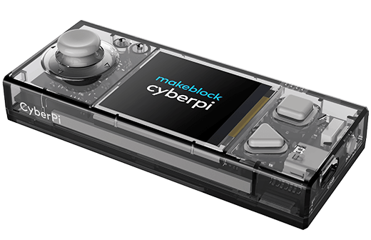

# CyberPi Telemetry Monitor



Real-time telemetry system for CyberPi, designed to visualize system metrics from a remote host through HTTP polling and dynamic LED feedback.

---

## 🔎 Overview

The device connects to Wi-Fi, periodically queries a `/status` endpoint, and renders live system metrics:

- CPU usage (%)
- RAM usage (%)
- Temperature (°C)
- CyberPi battery level (%)

In addition to the display output, the LED array provides a reactive visual layer based on system load and variation over time.

---

## 📐 System Architecture

The runtime flow is intentionally linear and predictable:

Wi-Fi connection → HTTP polling → JSON parsing → delta computation → display rendering → LED update

No external dependencies beyond `python3-psutils`, `cyberpi` and `urequests`.

---

## 📡 Expected API

The remote server must expose:

GET http://<SERVER_IP>:8080/status

Example response:

```bash
{
"host": "server-name",
"cpu": 35,
"ram": 62,
"temp": 58
}
```
---

## 💡 LED Behavior Model

The LED system is split into two semantic layers:

### 1. State (base load)

Represents absolute system load:

- Green → Normal
- Yellow → Warning range
- Red → Critical load

### 2. Activity (delta response)

Represents change intensity between updates:

- Low variation → stable, soft output
- High variation → brighter, more reactive output

### LED mapping

- LED 1/2 → CPU
- LED 3/4 → RAM
- LED 5 → Temperature

This separation allows both stability and motion perception without visual noise.

---

## 📺 Display Output

The screen shows a compact telemetry block:

```bash
CPU       14%
MEM       55%
TEMP      58C
BATT     100%
```

Updated every polling cycle.

---

## 🚫 Offline Mode

When the server is unreachable:

- All LEDs blink in magenta
- Display shows OFFLINE state
- System continues retry attempts automatically

---

## 🚀 Boot Sequence

On startup:

- Sequential RGB LED initialization
- Static system identity screen
- Transition into live monitoring mode after Wi-Fi connection

---

## ⚙ Configuration

Edit directly in the main script:

```bash
WIFI_SSID = ""
WIFI_PASS = ""
SERVER_IP = ""
SERVER_PORT = 8080
```

---

## 🚨 Requirements

- MakeBlock CyberPi (firmware supporting `cyberpi` and `urequests`)
- `python3-psutils` (HTTP server exposing `/status`)
- Stable Wi-Fi connection

---

## Known Limitations

- No persistent caching layer
- Basic retry logic only
- LED 5 dedicated to temperature only
- No authentication layer on API endpoint

---

## Future Improvements

- LED decay model per channel (persistent motion effect)
- WebSocket-based streaming instead of polling
- Configurable thresholds via remote config file
- Power-saving / dimming modes
- Web dashboard mirroring device state

---

## Status

Stable (v0.1.0)

Focused on real-time telemetry with deterministic visual feedback and low system complexity.
